= ZX123 Tool Manual
:author: kounch
:revnumber: 1.0.2
:doctype: book
:notitle:
:front-cover-image: 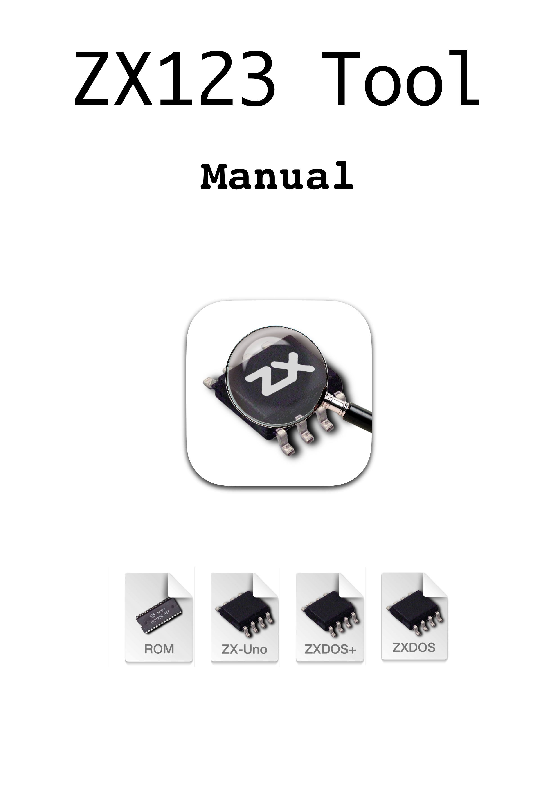
:email: kounch@users.noreply.github.com
:Revision: 1.0
:description: English ZX123 Tool Manual
:keywords: Manual, English, ZX123 Tool, ZX-Uno, ZXDOS, ZXDOS+
:icons: font
:source-highlighter: rouge
:toc: left
:toc-title: Index
:toclevels: 4

<<<

== Introduction

[.text-center]
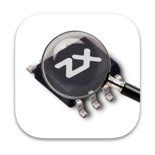

ZX123 Tool is a tool that analyzes, extracts and injects data in SPI flash image files for ZX-Uno, ZXDOS and similar devices.

These are its main features:

- List the contents of a ZX-Uno, etc. SPI flash image, showing, if possible, the version of BIOS, esxdos, main Spectrum core and optional cores, Spectrum ROMs and several BIOS settings
- Extract BIOS, esxdos ROM, Spectrum core and/or other cores, Spectrum ROMs to individual files
- Change some BIOS default options (video mode, keyboard layout, default core, default ROM, etc.)
- Add or replace FPGA cores and/or Spectrum ROM images (from individual ROM files or RomPack files)
- If supplied a different kind of file (like a core or BIOS installation file) it will also try to identify its contents
- For secondary cores, show information about some of the features that they may have (e.g. VGA video out, joystick support, supported SD or microSD formats, etc.)
- Wipe with zeros all Cores and ZX Spectrum ROMs data
- Create a copy of the flash image and, optionally, and/or truncate some (or all) of the optional cores (command line only)
- List, add or extract ROMs from a ROMPack v2 file (command line only)

It uses internally a file <<#_json_file,`zx123_hash.json`>> with the block structure of image files and, optionally, data to identify those blocks. If it is not found, it will try to download it from the repository on GitHub.

== Installation

There are different versions of the tool, one that works in a lot of platforms, but that may need to install Python 3, and other versions that doesn't need it, but aren't available for all systems.

=== MacOS

The MacOS binary isn't digitally signed, so you have to authorize the operating system to open de app, using the Finder contextual menu and choosing "Open".

[.text-center]
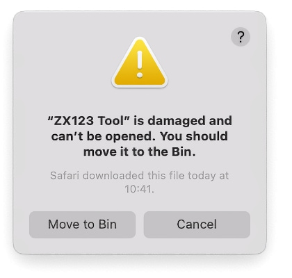

Alternatively, you can remove the quarantine attribute from the Terminal with a command like `xattr -d com.apple.quarantine "ZX123 Tool.app"`.

=== Windows

The Windows binary release requires Microsoft Visual C++ Redistributable 2015 installed on your system and, for Windows 7, also Microsoft Quality Rollup KB4457144 or later.

Once extracted, you have to run from the program (`ZX123 Tool.exe`) using Python 3.

<<<

=== All platforms

To use the tool this way, you need https://www.python.org/[Python 3] to use it. Depending on the operating system you may have to https://www.python.org/downloads/[install it]. It has to be version 3.8 or later.

Having Python 3, you only need to download the latest version of the tool from the official repository, following https://github.com/kounch/zx123_tool/releases/latest[this link].

Once extracted, you have to run from a shell the main script (`ZX123 Tool.py`) using Python 3. This may change depending on the operating system.

For example, on Windows, it's usually:

[source,shell]
----
py -3 "ZX123 Tool.py"
----

With other operating systems it is normally like:

[source,shell]
----
python3 "./ZX123 Tool.py"
----

== Use

=== Graphical user interface

The interface is based on a single window configured like this:

[.text-center]
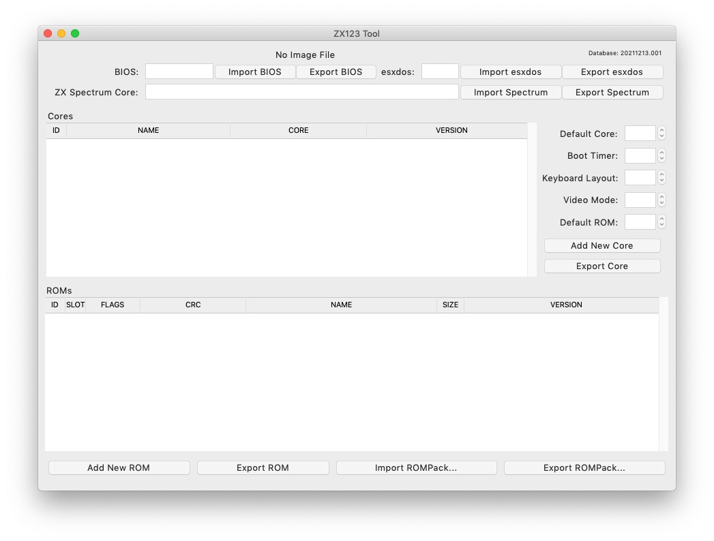

There's also a menu where you can access options to create a new SPI flash image file, open an existing file (either image or other kind) to analyze or edit (only if it's a flash image), wipe with zeros all the cores and ROMs data, expand a 16MB ZXDOS+ image to 32MB, stop editing, <<#_update_an_image,update the contents of an image>>, convert between main and secondary core (and vice versa), or show details for the currently selected core.

[.text-center]
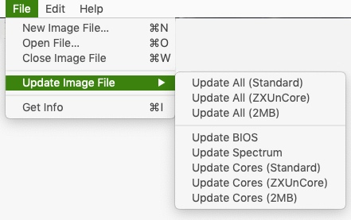

<<<

When opening a non-image file, the tool will try to analyze and catalog it's contents and show the known details for it:

[.text-center]
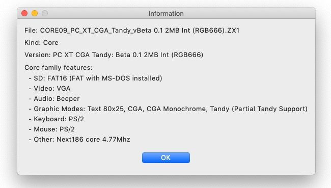

Once an image file is open to edit, it's possible to make the following modifications.

==== BIOS

Using the corresponding buttons, it is possible to export a file with the current BIOS (firmware) of the image, or to replace it (Import) with another one.

[.text-center]

In addition, you can modify some of the default startup values.

[.text-center]
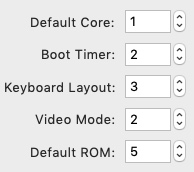

For reference, these are the meanings of some of the values.

|===
|Setting
|Description
Boot Timer
|0 (No Timer), 1, 2, 3 or 4
|Keyboard Layout
|0 (Auto), 1 (ES), 2 (EN) or 3 (Spectrum)
|Video mode
|0 (PAL), 1 (NTSC) or 2 (VGA)
|===

==== esxdos

Using the corresponding buttons, it is possible to export a file with the current version of esxdos in the image, or to replace it (Import) with another one.

[.text-center]

==== Spectrum Core

Using the corresponding buttons, it is possible to export a file with the current version of the Spectrum main core in the image, or to replace it (Import) with another one.

[.text-center]
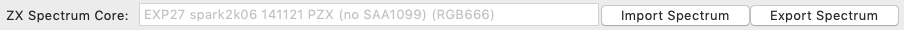

==== Secondary cores

If no secondary core is selected in the list, it is possible to use the button to add a new one.

[.text-center]
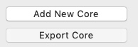

When one or more cores are selected, it is possible to replace the first one with another one (Import) or to export each of the selected cores to separate files.

[.text-center]
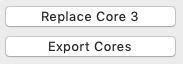

==== Spectrum ROMs

If no ROM is selected from the corresponding list, it is possible to use the Add button to add a new one. You can also replace or export all ROMs in the image using a single ROMPack file (v1).

[.text-center]

When one or more ROMs are selected, it is possible to replace the first one with another one of the same size (Import) or to export each of the selected ROMs to separate files.

[.text-center]

<<<

When loading a ROM file, you can specify the flags to use when using the ROM, such as memory contention, DivMMC, timings of different Spectrum models, etc.

[.text-center]
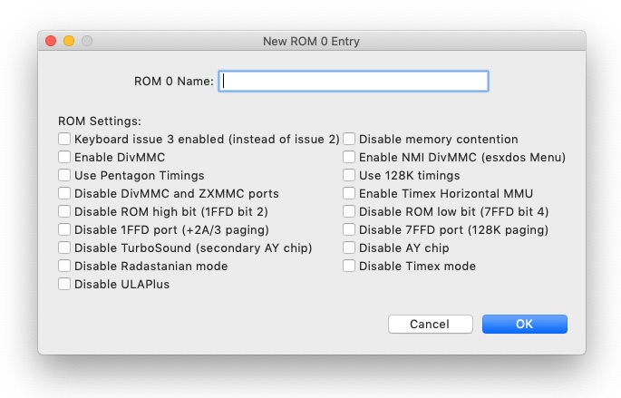

The settings for each ROM are listed with a letter code that is explained in the <<#_rom_parameters,appendix at the end of this manual>>.

==== Update an image

From the menu, you can choose several options that try to update, either individually or all together, BIOS and cores to the latest version, according to the contents of the JSON file, being possible, when updating cores, to search for the ZX-Uno standard version, ZXUnCore (RGB666 DAC) adapted cores or 2MB internal memory adapted cores.

<<<

==== Preferences

On the preferences window you chan change the default behaviour for some actions of the application.

[.text-center]
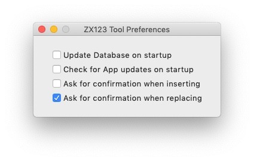

- Automatically update the cores, ROMs, etc. database each time that the application is opened

- Check for new versions of the software, also each time that the application is opened

- Ask for a confirmation before applying changes when adding a new core or ROM

- Ask for a confirmation before applying changes when replacing the contents of an existing core or ROM

- Remember main window and preferences window positions (if not, both windows are always centered)

<<<

=== Command line interface

==== All platforms

The CLI can be invoked directly using the script `zx123_tool.py` and Python (version 3.6 or later), (e.g. `python3 zx123_tool.py -l -i FLASH.ZX1`)

==== MacOS

Alternatively, if your system does not have Python 3, you can call the MacOS binary from Terminal, addíng the parameter `--command` (e.g. `"/Applications/ZX123 Tool.app/Contents/MacOS/ZX123 Tool" --command -l -i flash.ZX1``)

==== Arguments

[source]
----
-h, --help          show help and exit
-v, --version       show program's version number and exit
-i INPUT_FILE, --input_file INPUT_FILE
                    ZX-Uno, ZXDOS, etc. File
-d OUTPUT_DIR, --output_dir OUTPUT_DIR
                      Output directory for extracted files
-o OUTPUT_FILE, --output_file OUTPUT_FILE
                      Output flash file to copy
-f, --force           Force overwrite of existing files
-l, --list_contents List file contents
-D, --details       Show Known Core Features
-r, --roms          Process ZX Spectrum ROMs (list or, in extract mode,
                    extract instead of Cores)
-q, --check_updated For each Core or non Spectrum ROM, check version
                    against 'latest' entry in the JSON database
-s, --show_hashes   Show computed hashes
-x EXTRACT, --extract EXTRACT
          Item(s) to extract, split using ",": BIOS, Spectrum, Special,
          ROMS, esxdos and/or core/ROM Number(s)
-n N_CORES, --number_of_cores N_CORES
          Number of cores to keep on output file
-a INJECT_DATA, --add INJECT_DATA
          Data of item to inject with one of these formats:
              BIOS,Path to BIOS binary
              esxdos,Path to esxdos ROM binary
              Spectrum,Path to Spectrum core binary
              Special,Path to Special core binary (for 32Mb SPI flash)
              CORE,Core Number,Name to use,Path to core binary
              ROM,Slot,Parameters,Name to use,Path to Spectrum ROM binary
              ROMS,Path to RomPack file with some ROMs inside
-w, --wipe            Wipe all ROMs and all secondary cores from image
-e, --32              Expand, if needed, flash file to 32MiB
-t, --convert   Converts between standard and Spectrum core
----

[source]
----
-1, --1core  Use, if available, ZXUnCore cores for ZX-Uno
-2, --2mb  Use, if available, 2MB cores for ZX-Uno
-c DEFAULT_CORE, --default_core DEFAULT_CORE
          Default core number: 1 and up
-z DEFAULT_ROM, --default_rom DEFAULT_ROM
          Index of default Spectrum ROM: 0 and up
-m VIDEO_MODE, --video_mode VIDEO_MODE
              Default BIOS video mode: 0 (PAL), 1 (NTSC) or 2 (VGA)
-k KEYBOARD_LAYOUT, --keyboard_layout KEYBOARD_LAYOUT
              Default BIOS Keyboard Layout:
                              0 (Auto), 1 (ES), 2 (EN) or 3 (Spectrum)
-b BOOT_TIMER, --boot_timer BOOT_TIMER
                              Boot Timer: 0 (No Timer), 1, 2, 3 or 4
-u, --update   If it's the only argument, download JSON from repository
                If there's an SPI flash image file, update BIOS and Cores to the latest version according to JSON file contents
-N, --nocolours Disable the use of colours in terminal text output
----

==== Examples

Show contents of file:

    python3 zx123_tool.py -i FLASH.ZXD -l

Show contents of file, including the installed cores and ZX Spectrum ROMs data:

    python3 zx123_tool.py -i FLASH.ZXD -l -r

Show the installed cores, and list known features of them:

    python3 zx123_tool.py -i FLASH.ZXD -l -D

Extract `FIRMWARE.ZXD` file from `FLASH32.ZXD` file (on Windows):

    py -3 zx123_tool.py -i FLASH32.ZXD -x BIOS

Extract the third ZX Spectrum ROM to a file:

    ...zx123_tool.py -i FLASH32.ZXD -r -x 3

Extract all Spectrum ROMs to `ROMS.ZX1` RomPack file from `FLASH32.ZXD` file:

    ...zx123_tool.py -i FLASH32.ZXD -x ROMS

Show contents of file and extract `SPECTRUM.ZXD`, `ESXDOS.ZXD` and `.ZXD` files for cores 1 and 3:

    ...zx123_tool.py -l -i FLASH32.ZXD -x Spectrum,3,1,esxdos

Add core `NEXT.ZXD` as number `3`, with name `SpecNext`:

    ...zx123_tool.py -i FLASH.ZXD -o FLASHnew.ZXD -a CORE,3,SpecNext,NEXT.ZXD

Add core `NEXT.ZXD` as number `3`, with name `SpecNext`, and set as the default boot core:

    ...zx123_tool.py -i FLASH.ZXD -o FLASHnew.ZXD -a CORE,3,SpecNext,NEXT.ZXD -c 3

Add file `48.rom` (Spectrum ROM) in slot `5`, with name `Spec48`:

    ...zx123_tool.py -i FLASH.ZXD -o FLASHnew.ZXD -a ROM,5,xdnlh17,Spec48,48.rom

Set ROM with index 2 (do not mistake with slot index) as the default Spectrum ROM:

    ...zx123_tool.py -i FLASH.ZXD -o FLASHnew.ZXD -z 2

Add BIOS and esxdos ROMs:

    ...zx123_tool.py -i FLASH.ZXD -o FLASHnew.ZXD -a BIOS,FIRMWARE.ZXD -a esxdos,ESXMMC.BIN

Replace all Spectrum ROMs with the contents of `MyROMS.ZX1` RomPack file:

    ...zx123_tool.py -i FLASH.ZXD -o FLASHnew.ZXD -a ROMS,MyROMS.ZX1

Wipe all ROMs data and all secondary cores data:

    ...zx123_tool.py -i FLASH.ZXD -w -o FLASHempty.ZXD

Wipe all ROMs data and all secondary cores data, and then add file `48.rom` (Spectrum ROM) in slot `0`, with name `ZX Spectrum`:

    ...zx123_tool.py -i FLASH.ZXD -w -o FLASHnew.ZXD -a "ROM,0,xdnlh17,ZX Spectrum,48.rom"

Create a copy of `FLASH32.ZXD`, but removing all cores and setting BIOS default to VGA and Spectrum keyboard layout:

    ...zx123_tool.py -i FLASH32.ZXD -o FlashGDOSPlus.ZXD -n 0 -m 2 -k 3

Find out the version of a BIOS installation file:

    ...zx123_tool.py -i FIRMWARE.ZXD -l

Convert the contents of a classic ROMPack file to a ROMPack v2 file:

    ...zx123_tool.py -i ROMS_255_orig.ZX1 -o ROMS_255.ZX1 -a ROMS,MyROMS.ZX1

Add a ROM to a ROMPack v2 file:

    ...zx123_tool.py -i ROMS_255_orig.ZX1 -o ROMS_255.ZX1 -a "ROM,0,xdnlh17,ZX Spectrum,48.rom"

    ...zx123_tool.py -i ROMS_255_orig.ZX1 -o ROMS_255.ZX1 -a ROMS,MyROMS.ZX1

Extract ROMs with indexes 3, 5 and 6 from a ROMPack v2 file:

    ...zx123_tool.py -i ROMS_255.ZX1 -x 3,5,6

== Appendix

=== ROM parameters

[align="center",width="60%",%header,cols="1,4",options="header"]
|===
|Parameter
|Description
|`i`
|Keyboard issue 3 enabled (instead of issue 2)
|`c`
|Disable memory contention
|`d`
|Enable DivMMC
|`n`
|Enable NMI DivMMC (esxdos Menu)
|`p`
|Use Pentagon Timings
|`t`
|Use 128K timings
|`s`
|Disable DivMMC and ZXMMC ports
|`m`
|Enable Timex Horizontal MMU
|`h`
|Disable ROM high bit (1FFD bit 2)
|`l`
|Disable ROM low bit (7FFD bit 4)
|`1`
|Disable 1FFD port (+2A/3 paging)
|`7`
|Disable 7FFD port (128K paging)
|`2`
|Disable TurboSound (secondary AY chip)
|`a`
|Disable AY chip
|`r`
|Disable Radastanian mode
|`x`
|Disable Timex mode
|`u`
|Disable ULAPlus
|===

<<<

=== JSON file

The JSON file is an object where the main name are file extensions (like `ZXD` or `ZX1`). All the data in the JSON is stored as a string. For each of the possible extensions, there is another object with the following structure:

[source]
----
(...)
"(Extension)": {
    "description" -> Short Description of the platform asssociated (e.g. "ZXDOS+")
    "hashtype"    -> "sha256sum" at this moment
    "parts": {    -> Description of SPI Flash Main Blocks
                      For each of these, an array is provided with this data:
                            [offset, size, <output name>, <magic bytes>]
                      The blocks are:
                        - "header"    -> File header and descriptors
                        - "esxdos"    -> esxdos binary ROM
                        - "roms_dir"  -> Description of installed Spectrum ROMs
                        - "cores_dir" -> Description of installed extra FPGA cores
                        - "BIOS"      -> Binary image of firmware
                        - "roms_data" -> Spectrum ROMs binary data
                        - "Spectrum"  -> Main FPGA core
                        - "Special"   -> Special core (if it exists) for 32Mb SPI flash
                        - "core_base" -> Extra cores starting offset and size
    },
    "BIOS": {   -> Dictionary of hashes for different firmware versions in the format:
                    latest" -> Name of the latest version and (optionally) download URL
                    "versions":  {   -> Hash Dictionary
                                        "(Version Description)": "(Hash)",
                    }
    },
    "esxdos": {  -> Dictionary of hashes for different esxdos ROM versions in the format:
                    "latest" -> Name of the latest version
                    "versions":  {   -> Hash Dictionary
                                        "(Version Description)": "(Hash)",
                    }
    },
    "Spectrum": {   -> Dictionary of hashes for different Spectrum core versions in the format:
                        "latest" -> Name of the latest version and (optionally) download URL
                        "versions":  {   -> Hash Dictionary
                                            "(Version Description)": "(Hash)",
                        }
    "Special": {   -> Dictionary of hashes for different Special core versions in the format:
                      "latest" -> Name of the latest version and (optionally) download URL
                      "versions":  {   -> Hash Dictionary
                                          "(Version Description)": "(Hash)",
                      }
    "Cores": {   -> Dictionary for different FPGA cores
        "(Core name)": {   -> Dictionary of hashes for different core versions in the format:
                            "latest" -> Name of the latest version and (optionally) download URL
                            "base"   -> Name of another version with download URL if there's no URL for the latest
                            "versions":  {   -> Hash Dictionary
                                                "(Version Description)": "(Hash)",
                            },
                            "features":  {   -> Feature info Dictionary
                                                "Category": [["Feature", "Feature", ...], "Note"]
                            }
        },
        (...)
    }
}.
(...)
----

`roms_dir` format:

[source]
----
[roms directory offset, directory block size, "", "", enabled entries offset, first ROMs block length, second ROMs block length]
----

`cores_dir` format:

[source]
----
[cores directory offset, directory block size, "", "", first cores block length, second cores block length]
----

`roms_data` format:

[source]
----
[first slot offset, first ROMs block size, "", "", second ROMs block offset],
----

`core_base` format:

[source]
----
[first core offset, core length, "", First bytes of a binary core data, second cores block offset]
----

<<<

=== ROMPack v2

ROMPack v2 files are based on classic ROMPack files, used to extract and insert all the ROM files in a ZX-Uno, ZXDOS SPI flash. Classic ROMpack files have 64 ROM slots while ROMPack v2 files have 255 ROM slots. The file structure of a ROMPAck file is as follows:

[align="center",width="75%",%header,cols="1,1,6",options="header"]
|===
|Start
|End
|Description
|`0x000000`
|`0x000003`
|Signature 'RPv2'
|`0x000004`
|`0x00003F`
|Reserved. Unused (pad with `0x00`)
|`0x000040`
|`0x003FFF`
|Up to 255 64 bytes blocks (ROM Entries) (pad with `0x00`)
|`0x004000`
|`0x0040FE`
|Up to 255 1 byte blocks with ROM Index Entries (pad with `0xFF`)
|`0x0040FF`
|`0x0040FF`
|Default ROM Index (1 byte)
|`0x004100`
|`0x4000FF`
|Up to 255 16384 bytes ROM slots (pad with `0x00`)
|===

Each ROM Entry block has this internal structure:

[align="center",width="70%",%header,cols="2,1,7",options="header"]
|===
|Start
|End
|Description
|`0x00`
|`0x00`
|Slot offset
|`0x01`
|`0x01`
|Slot size
|`0x02`
|`0x02`
|Flags 1:
|`0x02`:Bit `0`
| Bit `1`
|Machine timings: `00`=48K `01`=128K, `10`=Pentagon
|`0x02`:Bit `2`
|Bit `2`
|NMI DivMMC: `0`=disabled, `1`=enabled
|`0x02`:Bit `3`
|Bit `3`
|DivMMC: `0`=disabled, `1`=enabled
|`0x02`:Bit `4`
|Bit `4`
|Contention: `0`=disabled, `1`=enabled
|`0x02`:Bit `5`
|Bit `5`
|Keyboard issue: `0`=issue 2, `1`=issue 3
|`0x03`
|`0x03`
|Flags 2:
|`0x03`:Bit `0`
|Bit `0`
|AY chip: `0`=enabled, `1`=disabled
|`0x03`:Bit `1`
|Bit `1`
|2nd AY chip (TurboSound): `0`=enabled, `1`=disabled
|`0x03`:Bit `2`
|Bit `2`
|`7ffd` port: `0`=enabled, `1`=disabled
|`0x03`:Bit `3`
|Bit `3`
|`1ffd` port: `0`=enabled, `1`=disabled
|`0x03`:Bit `4`
|Bit `4`
|ROM low bit: `0`=enabled, `1`=disabled
|`0x03`:Bit `5`
|Bit `5`
|ROM high bit: `0`=enabled, `1`=disabled
|`0x03`:Bit `6`
|Bit `6`
|horizontal MMU in Timex: `0`=disabled, `1`=enabled
|`0x03`:Bit `7`
|Bit `7`
|DivMMC and ZXMMC ports: `0`=enabled, `1`=disabled
|`0x08`
|`0x0F`
|crc16-ccitt values. Up to 4 16-bit values in reverse order
|`0x10`
|`0x1F`
|unused
|`0x20`
|`0x3F`
|Name of ROM in ASCII, space padded
|===

== Copyright

Copyright (c) 2020-2021, kounch
All rights reserved.

Redistribution and use in source and binary forms, with or without modification, are permitted provided that the following conditions are met:

- Redistributions of source code must retain the above copyright notice, this list of conditions and the following disclaimer.

- Redistributions in binary form must reproduce the above copyright notice, this list of conditions and the following disclaimer in the documentation and/or other materials provided with the distribution.

THIS SOFTWARE IS PROVIDED BY THE COPYRIGHT HOLDERS AND CONTRIBUTORS "AS IS" AND ANY EXPRESS OR IMPLIED WARRANTIES, INCLUDING, BUT NOT LIMITED TO, THE IMPLIED WARRANTIES OF MERCHANTABILITY AND FITNESS FOR A PARTICULAR PURPOSE ARE DISCLAIMED. IN NO EVENT SHALL THE COPYRIGHT HOLDER OR CONTRIBUTORS BE LIABLE FOR ANY DIRECT, INDIRECT, INCIDENTAL, SPECIAL, EXEMPLARY, OR CONSEQUENTIAL DAMAGES (INCLUDING, BUT NOT LIMITED TO, PROCUREMENT OF SUBSTITUTE GOODS OR SERVICES; LOSS OF USE, DATA, OR PROFITS; OR BUSINESS INTERRUPTION) HOWEVER CAUSED AND ON ANY THEORY OF LIABILITY, WHETHER IN CONTRACT, STRICT LIABILITY, OR TORT (INCLUDING NEGLIGENCE OR OTHERWISE) ARISING IN ANY WAY OUT OF THE USE OF THIS SOFTWARE, EVEN IF ADVISED OF THE POSSIBILITY OF SUCH DAMAGE.

"Loupe PNG image" from <http://pngimg.com> is licensed under CC BY-NC 4.0

Jarik Marwede (Center tk window <https://github.com/jarikmarwede/center-tk-window>)

MIT License

Copyright (c) 2019 Jarik Marwede

Permission is hereby granted, free of charge, to any person obtaining a copy of this software and associated documentation files (the "Software"), to deal in the Software without restriction, including without limitation the rights to use, copy, modify, merge, publish, distribute, sublicense, and/or sell copies of the Software, and to permit persons to whom the Software is furnished to do so, subject to the following conditions:

The above copyright notice and this permission notice shall be included in all copies or substantial portions of the Software.

THE SOFTWARE IS PROVIDED "AS IS", WITHOUT WARRANTY OF ANY KIND, EXPRESS OR IMPLIED, INCLUDING BUT NOT LIMITED TO THE WARRANTIES OF MERCHANTABILITY, FITNESS FOR A PARTICULAR PURPOSE AND NONINFRINGEMENT. IN NO EVENT SHALL THE AUTHORS OR COPYRIGHT HOLDERS BE LIABLE FOR ANY CLAIM, DAMAGES OR OTHER LIABILITY, WHETHER IN AN ACTION OF CONTRACT, TORT OR OTHERWISE, ARISING FROM, OUT OF OR IN CONNECTION WITH THE SOFTWARE OR THE USE OR OTHER DEALINGS IN THE SOFTWARE.
