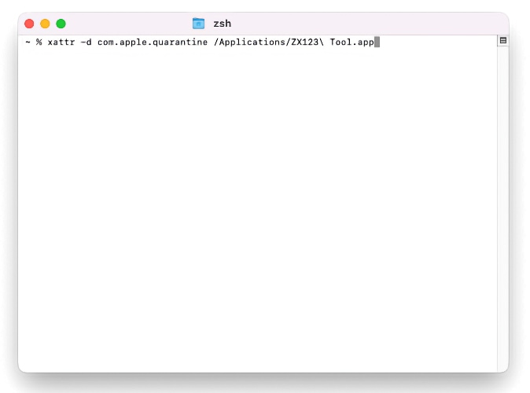
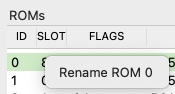
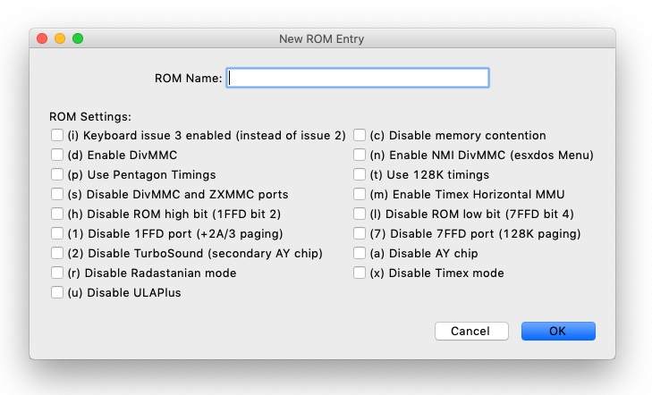
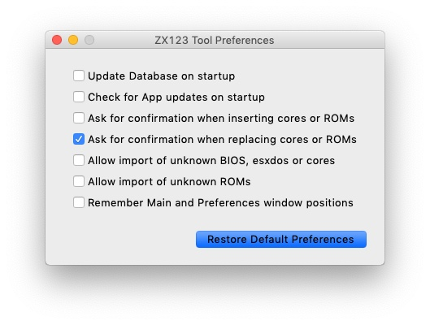

= Manual de ZX123 Tool
:author: kounch
:revnumber: 1.2.0
:doctype: book
:notitle:
:front-cover-image: image:../img/Portada.jpg[]
:email: kounch@users.noreply.github.com
:Revision: 1.2
:description: Manual en Castellano de ZX123 Tool
:keywords: Manual, Castellano, ZX123 Tool, ZX-Uno, ZXDOS, ZXDOS+
:icons: font
:source-highlighter: rouge
:toc: left
:toc-title: Índice
:toclevels: 4

<<<

== Introducción

[.text-center]
image:../img/Logo.jpg[pdfwidth=20%]

ZX123 Tool es una herramienta que analiza, extrae o añade datos en ficheros de imagen de SPI flash de ZX-Uno, ZXDOS y otros dispositivos similares.

Estas son sus funciones principales:

- Mostrar el contenido de la imagen, diciendo, si es posible, la versión de BIOS, esxdos, el core principal de Spectrum, otros cores que haya instalados, ROMs de Spectrum y algunos ajustes de la BIOS
- Extraer la BIOS, la ROM de esxdos, el core de Spectrum y/o otros cores, ROMs de Spectrum a ficheros individuales
- Cambiar algunas opciones por defecto de la BIOS (modo de vídeo, distribución de teclado, core por defecto, ROM de Spectrum por defecto, etc.)
- Añadir o reemplazar cores de la FPGA y/o imágenes de ROM de Spectrum (desde ficheros de ROM individuales o un fichero RomPack)
- Si se tratase de un tipo distinto de fichero (como un archivo de instalación de core o BIOS), también puede intentar identificar su versión
- Para Cores secundarios, mostrar información sobre algunas de las características que podrían tener (Ej: Salida por VGA, uso de joystick, formato soportado de tarjeta SD o MicroSD, etc.)
- Borrar con ceros todos los datos de los Cores y las ROMs de ZX Spectrum
- Crear una copia de la imagen y, opcionalmente, truncar alguno (o todos) los cores opcionales (sólo desde la línea de comandos)
- Mostrar, añadir o extraer ROMs de un fichero ROMPack v2 (sólo desde la línea de comandos)

Utiliza internamente un fichero <<#_archivo_json,`zx123_hash.json`>> con la estructura de bloques del archivo de imagen y, opcionalmente, datos para identificar dichos bloques. Si no se encuentra, intentará descargarlo desde el repositorio en GitHub.

== Instalación

Existen varias versiones de la utilidad, una que funciona en muchas plataformas y sistemas operativos, pero que podría necesitar instalar Python 3, y otras que no lo necesitan, pero no están disponibles para todos los sistemas.

=== MacOS

El binario para MacOS no está firmado digitalmente, por lo que las versiones más recientes del sistema seguramente no confíen en él y muestren un aviso diciendo que el archivo está dañado y debe ser movido a la papelera.

[.text-center]
image:../img/MacOpenES.jpg[pdfwidth=50%]

Para poder utilizar la aplicación, asegúrese de que la ha obtenido de un lugar de confianza, y luego use Terminal con un comando como `xattr -d com.apple.quarantine "ZX123 Tool.app"` para ignorar el aviso.

[.text-center]

<<<

=== Windows

La versión de Windows requiere tener instalado Microsoft Visual C++ Redistributable 2015 en el sistema, y para Windows 7, además, las actualizaciones del paquete acumulativo KB4457144 o una versión superior.

Una vez descomprimido el fichero descargado, se debe ejecutar el programa (`ZX123 Tool.exe`).

=== Todas las plataformas

Para poder usar la herramienta así, se necesita https://www.python.org/[Python 3]. Según el sistema operativo que se utilice puede que sea necesario https://www.python.org/downloads/[instalarlo]. Ha de ser la versión 3.8 o una superior.

Teniendo Python 3, basta con descargar la última versión de los scripts la herramienta desde su repositorio oficial, https://github.com/kounch/zx123_tool/releases/latest[en este enlace] (elegir la descarga ).

Una vez descomprimido el fichero descargado, se debe invocar desde una consola el script principal (`ZX123 Tool.py`) usando Python 3. Esto puede variar según el sistema operativo.

Por ejemplo, en Windows, suele ser:

[source,shell]
----
py -3 "ZX123 Tool.py"
----

Mientras que en otros sistemas operativos debería bastar con algo parecido a:

[source,shell]
----
python3 "./ZX123 Tool.py"
----

== Uso

=== Interfaz gráfica

La interfaz de la utilidad es una única ventana con una configuración como la siguiente:

[.text-center]
image:../img/MainWindow.jpg[pdfwidth=70%]

Además, existe un menú desde el que se accede a opciones que permiten crear un nuevo archivo de imagen SPI flash, abrir un fichero existente (de imagen o de otro tipo) para analizarlo o modificarlo (sólo si es de imagen flash), borrar con ceros todos los datos de los Cores y las ROMs, expandir una imagen de ZXDOS+ de 16MB a 32MB, cerrar la edición, <<#_actualizar_una_imagen,actualizar el contenido de una imagen>>, convertir entre core principal y core secundario (y viceversa), o mostrar detalles del core actualmente seleccionado.

[.text-center]
image:../img/FileMenu.jpg[pdfwidth=50%]

<<<

Al abrir un fichero que no sea de imagen, la herramienta intentará catalogarlo y mostrar los detalles conocidos del mismo:

[.text-center]
image:../img/InfoWindow.jpg[pdfwidth=40%]

Por otro lado, una vez cargado un archivo de imagen para editar, es posible realizar las modificaciones que se explican a continuación.

==== BIOS

Usando los botones correspondientes, es posible exportar un fichero con la BIOS (firmware) actual de la imagen, o bien sustituirla (Import) por otra.

[.text-center]
image:../img/BIOS.jpg[pdfwidth=60%]

Además, también es posible modificar algunos de los valores de arranque por defecto.

[.text-center]
image:../img/DefaultBIOS.jpg[pdfwidth=25%]

Como referencia, estos son los significados de algunos de los valores.

[align="center",width="85%",%header,cols="2,3",options="header"]
|===
|Ajuste
|Descripción
|Retraso en el arranque (Timer)
|0 (Sin retraso), 1, 2, 3 ó 4 segundos
|Teclado (Keyboard)
|0 (Auto), 1 (ES), 2 (EN) ó 3 (Spectrum)
|Modo de vídeo por defecto
|0 (PAL), 1 (NTSC) ó 2 (VGA)
|===

==== esxdos

Usando los botones correspondientes, es posible exportar un fichero con la versión actual de esxdos de la imagen, o bien sustituirla (Import) por otra.

[.text-center]
image:../img/esxdos.jpg[pdfwidth=60%]

==== Core de Spectrum

Usando los botones correspondientes, es posible exportar un fichero con la versión actual del core principal de Spectrum de la imagen, o bien sustituirla (Import) por otra.

[.text-center]
image:../img/Spectrum.jpg[pdfwidth=100%]

==== Cores Secundarios

Si no está seleccionado ningún core secundario de la lista, es posible utilizar el botón para añadir (Add) uno nuevo.

[.text-center]
image:../img/Cores.jpg[pdfwidth=25%]

Por otra parte, cuando está seleccionado uno o más cores, es posible sustituir el primero de ellos por otro (Import) o bien exportar cada uno de los seleccionados a un fichero independiente.

[.text-center]
image:../img/CoresSelect.jpg[pdfwidth=25%]

También, cuando sólo se ha seleccionado un único core, es posible obtener información del mismo o cambiar el nombre que se muestra, bien utilizando las opciones en el menú, o bien haciendo un clic secundario sobre la lista de cores.

[.text-center]
image:../img/CoreRename.jpg[pdfwidth=25%]

<<<

==== ROMs de Spectrum

Si no está seleccionada ninguna ROM de la lista correspondiente, es posible utilizar el botón para añadir (Add) una nueva. También es posible reemplazar o exportar todas las ROMs de la imagen usando un único un fichero ROMPack (v1).

[.text-center]
image:../img/ROMs.jpg[pdfwidth=100%]

Por otra parte, cuando está seleccionada una o más ROMs, es posible sustituir la primera de ellas por otra del mismo tamaño (Import) o bien exportar cada una de las seleccionadas a un fichero independiente.

[.text-center]
image:../img/ROMsSelect.jpg[pdfwidth=100%]

Como en caso anterior, cuando sólo se ha seleccionado una única ROM, es cambiar el nombre que se muestra y sus parámetros haciendo un clic secundario sobre la lista de ROMs.

[.text-center]

Al cargar un fichero de ROM, se pueden especificar los indicadores para usar al utilizar la ROM, como la contención de memoria, DivMMC, timings de distintos modelos de Spectrum, etc.

[.text-center]

Los indicadores de cada ROM se muestran en la lista con un código de letras que se explica en el <<#_indicadores_de_rom,apéndice al final de este manual>>.

<<<

==== Actualizar una imagen

Desde el menú, se pueden elegir varias opciones que permiten intentar actualizar, tanto de forma individual como conjunta, BIOS y Cores a la última versión posible según se indica en el fichero JSON, siendo posible, en el caso de la actualización de cores, elegir si se quiere buscar la versión normal para cualquier ZX-Uno, cores específicos para ZXUnCore (con soporte para DAC RGB666) o cores que utilizan 2MB de memoria (interna).

==== Preferencias

La ventana de preferencias permite cambiar el comportamiento por defecto para algunas acciones de la aplicación.

[.text-center]

- Actualizar automáticamente la base de datos de cores, ROMs, ect. cada vez que se abra la aplicación (Update database...)

- Comprobar si hay versiones nuevas del software cada vez que se abra la aplicación (Check for App updates...)

- Pedir confirmación antes de aplicar cambios al añadir un nuevo core o ROM (Ask for confirmation when inserting...)

- Pedir confirmación antes de aplicar cambios al sustituir el contenido de un core o ROM existente (Ask for confirmation when replacing...)

- Permitir la importación de BIOS, esxdos o cores no catalogados en la base de datos (Allow import of unknown BIOS...)

- Permitir la importación de ROMs de ZX Spectrum no catalogadas en la base de datos (Allow import of unknown ROMs )

- Recordar la ubicación de la ventana principal y la de preferencias, o bien mostrarlas siempre en el centro (Remember window positions)

<<<

=== Interfaz de línea de comandos

==== Todas las plataformas

La interfaz de comandos se puede invocar directamente usando el script `zx123_tool.py` y Python (versión 3.6 o superior), (por ej. `python3 zx123_tool.py -l -i FLASH.ZX1`)

==== Argumentos

[source]
----
-h, --help          Mostrar ayuda y salir
-v, --version       Mostras versión del programa y salir
-i FICHERO_ORIGEN, --input_file FICHERO_ORIGEN
                    Archivo ZX-Uno, ZXDOS, etc.
-d DIRECTORIO_DESTINO, --output_dir DIRECTORIO_DESTINO
                    Directorio donde guardar los archivos extraídos
-o FICHERO_DESTINO, --output_file FICHERO_DESTINO
                    Fichero donde guardar copia de la imagen flash
-f, --force           Forzar sobreescribir archivos existentes
-l, --list_contents Mostrar contenido del fichero de origen
-D, --details       Mostrar características conocidas de los cores
-r, --roms          Procesar ROMs de ZX Spectrum (listar o, en modo de
                    extracción, extraer en vez de Cores)
-q, --check_updated Para cada Core o ROM que no sea de Spectrum, comparar
                    la versión con la entrada 'latest' del JSON
-s, --show_hashes   Mostrar los datos de hash calculados
-x EXTRAER, --extract EXTRAER
        Elemento(s) a extraer, separados por ",": BIOS, Spectrum,
        Special, ROMS, esxdos y/o número(s) de core/ROM
-n N_CORES, --number_of_cores N_CORES
        Número de cores a guardar en la copia
-a DATOS, --add DATOS
        Datos de un elemento a añadir siguiendo uno de estos formatos:
            BIOS,Ruta a fichero de BIOS
            esxdos,Ruta a fichero ROM de esxdos
            Spectrum,Ruta a core principal de Spectrum
            Special,Ruta a core especial para SPI flash de 32Mb
            CORE,Número,Nombre a usar,Ruta a fichero de core
            ROM,Slot,Parámetros,Nombre a usar,Ruta a ROM de Spectrum
            ROMS,Ruta a un archivo RomPack con varias ROMs
  -R DATOS, --rename Datos
        Datos de un elemento a renombrar (core o ROM) con el mismo formato
        que al añadir, pero sin nombre de fichero
-w, --wipe           Borrar todas las ROMs y todos los cores secundarios
-e, --32             Expandir, si hiciera falta la imagen a 32MiB
-t, --convert   Convierte entre core estándar y core de Spectrum
-1, --1core  Usar, si los hay, cores específicos para ZXUnCore
-2, --2mb  Usar, si los hay, cores que utilizan 2MB de memoria (interna)
----

[source]
----
-c CORE_D, --default_core CORE_D
        Número de core por defecto: 1 o superior
-z ROM_D, --default_rom ROM_D
        Índice de ROM de Spectrum por defecto: 0 o superior
-m VIDEO_MODE, --video_mode MODO_VIDEO
            Modo de vídeo por defecto de la BIOS:
                                        0 (PAL), 1 (NTSC) ó 2 (VGA)
-k KEYBOARD_LAYOUT, --keyboard_layout DISTRIB_TECLADO
            Distribución de teclado por defecto de la BIOS:
                            0 (Auto), 1 (ES), 2 (EN) ó 3 (Spectrum)
-b BOOT_TIMER, --boot_timer RETRASO
                Retraso en el arranque: 0 (Sin retraso), 1, 2, 3 ó 4
-u, --update   Si no hay más argumentos, descargar JSON del repositorio
                Si hay imagen SPI flash, actualizar BIOS y Cores a la
            última versión posible según se indica en el fichero JSON
-N, --nocolours Deshabilitar el uso de colores en el texto mostrado
----

==== Ejemplos

Mostrar contenido de una imagen:

    python3 zx123_tool.py -i FLASH.ZXD -l

Mostrar contenido de una imagen, incluyendo datos de cores instalados y de ROMs de ZX Spectrum:

    python3 zx123_tool.py -i FLASH.ZXD -l -r

Listar los cores instalados en una imagen, incluyendo información de características que podrían tener:

    python3 zx123_tool.py -i FLASH.ZXD -l -D

Extraer un fichero `FIRMWARE.ZXD` del archivo de imagen `FLASH32.ZXD` (en Windows):

    py -3 zx123_tool.py -i FLASH32.ZXD -x BIOS

<<<

Extraer la tercera ROM de ZX Spectrum a un fichero:

    ...zx123_tool.py -i FLASH32.ZXD -r -x 3

Extraer todas las ROMs de Spectrum a un archivo RomPack `ROMS.ZX1` desde el archivo de imagen `FLASH32.ZXD`:

    ...zx123_tool.py -i FLASH32.ZXD -x ROMS

Mostrar contenido de archivo de imagen y extraer `SPECTRUM.ZXD`, `ESXDOS.ZXD` y ficheros `.ZXD` para los cores 1 y 3:

    ...zx123_tool.py -l -i FLASH32.ZXD -x Spectrum,3,1,esxdos

Añadir el core `NEXT.ZXD` con el número `3`, con nombre`SpecNext`:

    ...zx123_tool.py -i FLASH.ZXD -o FLASHnew.ZXD -a CORE,3,SpecNext,NEXT.ZXD

Añadir el core `NEXT.ZXD` con el número `3`, con nombre`SpecNext`,y configurar como core de inicio por defecto:

    ...zx123_tool.py -i FLASH.ZXD -o FLASHnew.ZXD -a CORE,3,SpecNext,NEXT.ZXD -c 3

Añadir ROM de Spectrum `48.rom` en el slot `5`, con el nombre `Spec48`:

    ...zx123_tool.py -i FLASH.ZXD -o FLASHnew.ZXD -a ROM,5,xdnlh17,Spec48,48.rom

Configurar la ROM con índice 2 (no confundir con número de slot) como la ROM de Spectrum por defecto:

    ...zx123_tool.py -i FLASH.ZXD -o FLASHnew.ZXD -z 2

Añadir ROMs de BIOS y esxdos:

    ...zx123_tool.py -i FLASH.ZXD -o FLASHnew.ZXD -a BIOS,FIRMWARE.ZXD -a esxdos,ESXMMC.BIN

Reemplazar todas las ROMs con el contenido del fichero RomPack `MisROMS.ZX1`:

    ...zx123_tool.py -i FLASH.ZXD -o FLASHnew.ZXD -a ROMS,MisROMS.ZX1

Borrar todos los datos de ROMs y todos los datos de los cores secundarios:

    ...zx123_tool.py -i FLASH.ZXD -w -o FLASHempty.ZXD

Borrar todos los datos de ROMs y todos los datos de los cores secundarios, y luego añadir el fichero ROM de Spectrum `48.rom` en el slot `0`, con el nombre `ZX Spectrum`:

    ...zx123_tool.py -i FLASH.ZXD -w -o FLASHnew.ZXD -a "ROM,0,xdnlh17,ZX Spectrum,48.rom"

Crear una copia de `FLASH32.ZXD`, pero quitando todos los cores opcionales y configurando por defecto la BIOS para VGA y distribución de teclado tipo Spectrum:

    ...zx123_tool.py -i FLASH32.ZXD -o FlashGDOSPlus.ZXD -n 0 -m 2 -k 3

Averiguar la versión de un archivo de instalación de BIOS:

    ...zx123_tool.py -i FIRMWARE.ZXD -l

Convertir el contenido de un fichero ROMPack clásico a un fichero ROMPack v2:

    ...zx123_tool.py -i ROMS_255_orig.ZX1 -o ROMS_255.ZX1 -a ROMS,MyROMS.ZX1

Añadir una ROM a un fichero ROMPack v2:

    ...zx123_tool.py -i ROMS_255_orig.ZX1 -o ROMS_255.ZX1 -a "ROM,0,xdnlh17,ZX Spectrum,48.rom"

Extraer las ROMs con índices 3, 5 y 6 de un fichero ROMPack v2:

    ...zx123_tool.py -i ROMS_255.ZX1 -x 3,5,6

== Apéndices

=== Indicadores de ROM

[align="center",width="60%",%header,cols="1,4",options="header"]
|===
|Indicador
|Descripción
 |`i`
|Habilitar teclado issue 3 (en vez de issue 2)
|`c`
|Deshabilitar la contención de memoria
|`d`
|Habilitar DivMMC
|`n`
|Habilitar NMI DivMMC (menú de esxdos)
|`p`
|Usar timings de Pentagon
|`t`
|Usar timings de 128K
|`s`
|Deshabilitar puertos de DivMMC y ZXMMC
|`m`
|Habilitar MMU horizontal de Timex
|`h`
|Deshabilitar bit alto de ROM (bitd 2 de 1FFD)
|`l`
|Deshabilitar bit bajo de ROM (bit 4 de 7FFD)
|`1`
|Deshabilitar puerto 1FFD (paginado de +2A/3)
|`7`
|Deshabilitar puerto 7FFD (paginado de 128K)
|`2`
|Deshabilitar TurboSound (chip AY secundario)
|`a`
|Deshabilitar chip AY
|`r`
|Deshabilitar modo Radastaniano
|`x`
|Deshabilitar modo Timex
|`u`
|Deshabilitar ULAPlus
|===

<<<

=== Archivo JSON

El archivo JSON es un objeto donde los nombres principales son extensiones de archivo (como `ZXD` o `ZX1`). Todos los datos del fichero JSON se almacenan como cadenas de texto. Para cada extensión, se define otro objeto con la siguiente estructura:

[source]
----
(...)
"(Extensión)": {
    "description" -> Descripción corta de la plataforma asociada (ej: "ZXDOS+")
    "hashtype"    -> "sha256sum" por el momento
    "parts": {    -> Descripción de los bloques principales de una imagen SPI flash
                        Para cada uno de estos, se define una matriz con estos datos:
                            [desplazamiento, tamaño, <nombre de fichero>, <bytes de la cabecera>]
                        Los bloques son
                        - "header"    -> Cabecera y descriptores de imagen SPI Flash
                        - "esxdos"    -> ROM binaria de esxdos
                        - "roms_dir"  -> Descripción de las ROMs instaladas para Spectrum
                        - "cores_dir" -> Descripción de los cores FPGA instalados
                        - "BIOS"      -> Imagen binaria del firmware
                        - "roms_data" -> Datos binarios de las ROMs de Spectrum
                        - "Spectrum"  -> core principal de la FPGA
                        - "Special"   -> core especial (si existe) para SPI Flash de 32Mb
                        - "core_base" -> Desplazamiento y tamaño del primer core Extra
    },
    "BIOS": {   -> Diccionario con hashes para distintas versiones del firmware, con el formato:
                    "latest" -> Nombre de la última versión y (opcionalmente) URL de descarga
                    "versions":  {   -> Diccionario con hashes
                                        "(Descripción de versión)": "(Hash)"
                    }
    },
    "esxdos": {  -> Diccionario con hashes para distintas versiones de ROMS de esxdos, con el formato:
                    "latest" -> Nombre de la última versión
                    "versions":  {   -> Diccionario con hashes
                                        "(Descripción de versión)": "(Hash)"
                    }
    },
----

<<<

[source]
----
    "Spectrum": {   -> Diccionario con hashes para distintas versiones del core principal de Spectrum, con el formato:
                        "latest" -> Nombre de la última versión y (opcionalmente) URL de descarga
                        "versions":  {   -> Diccionario con hashes
                                            "(Descripción de versión)": "(Hash)"
                        }
    "Special": {   -> Diccionario con hashes para distintas versiones del core espcial (si existe), con el formato:
                        "latest" -> Nombre de la última versión y (opcionalmente) URL de descarga
                        "versions":  {   -> Diccionario con hashes
                                            "(Descripción de versión)": "(Hash)"
                        }
    "Cores": {   -> Diccionario para distintos cores extra para la FPGA
        "(Nombre de core)": {   -> Diccionario con hashes para distintas versiones del core, con el formato:
                                    "latest" -> Nombre de la última versión y (opcionalmente) URL de descarga
                                    "base"   -> Nombre de otra versión descargable si la última no la tiene
                                    "versions":  {   -> Diccionario con hashes
                                                        "(Descripción de versión)": "(Hash)"
                                    },
                                    "features":  {   -> Diccionario con información de características
                                                        "Categoría": [["Característica", "Caractetrística", ...], "Nota"]
                                    }
        },
        (...)
    }
}.
(...)
----

<<<

Para `roms_dir`, el formato es el siguiente:

[source]
----
[offset de inicio del directorio, tamaño del bloque de directorio, "", "", offset de entradas activas, longitud del primer bloque de ROMs, longitud del segundo bloque de ROMs]
----

Para `cores_dir`, el formato es el siguiente:

[source]
----
[offset de inicio del directorio, tamaño del bloque de directorio, "", "", longitud del primer bloque de cores, longitud del segundo bloque de cores]
----

Para `roms_data`, el formato es el siguiente:

[source]
----
[offset del primer slot, tamaño del primer bloque de ROMs, "", "", offset del segundo bloque de ROMs],
----

Para `core_base`, el formato es el siguiente:

[source]
----
[offset del primer core, longitud de un core, "", Primeros bytes de un fichero binario de core, offset del segundo bloque de cores]
----

<<<

=== ROMPack v2

Los ficheros ROMPack v2 se basan en los ficheros ROMPack clásicos, que se utilizan para extraer e insertar todas las ROM en la flash SPI de un ZX-Uno, ZXDOS, etc. Los ficheros ROMPack clásicos tienen 64 ranuras de 16K (slots) de espacio de almacenamiento, mientras que los ficheros ROMPack v2 disponen de 255 espacios. La estructura de un archivo ROMPack es la siguiente:

[align="center",width="85%",%header,cols="1,1,7",options="header"]
|===
|Inicio
|Fin
|Descripción
|`0x000000`
|`0x000003`
|Firma 'RPv2'
|`0x000004`
|`0x00003F`
|Reservado. Sin usar (rellenar con `0x00` hasta el final)
|`0x000040`
| `0x003FFF`
| Hasta 255 bloques de 64 bytes (ROM Entry) (rellenar con 0x00 hasta el final)
|`0x004000`
| `0x0040FE`
| Hasta 255 bloques de 1 byte con índice de ROM Entry (rellenar con `0xFF` hasta el final)
|`0x0040FF`
| `0x0040FF`
| Índice de ROM por defecto (1 byte)
|`0x004100`
| `0x4000FF`
| Hasta 255 slots de 16384 bytes (rellenar con `0x00` hasta el final)
|===

Cada bloque (ROM Entry), a su vez, tiene esta estructura:

[align="center",width="80%",%header,cols="2,1,8",options="header"]
|===
|Inicio
|Fin
|Descripción
|`0x00`
|`0x00`
|Offset de primer Slot utilizado
|`0x01`
|`0x01`
|Tamaño en slots
|`0x02`
|`0x02`
|Flags 1:
|`0x02`:Bit `0`
|Bit `1`
|Machine timings: `00`=48K `01`=128K, `10`=Pentagon
|`0x02`:Bit `2`
|Bit `2`
|NMI DivMMC: `0`=deshabilitado, `1`=habilitado
|`0x02`:Bit `3`
|Bit `3`
|DivMMC: `0`=deshabilitado, `1`=habilitado
|`0x02`:Bit `4`
|Bit `4`
|Contención: `0`=deshabilitada, `1`=habilitada
|`0x02`:Bit `5`
|Bit `5`
|Keyboard issue: `0`=issue 2, `1`=issue 3
|`0x03`
|`0x03`
|Flags 2
|`0x03`:Bit `0`
|Bit `0`
|Chip AY: `0`=habilitado, `1`=deshabilitado
|`0x03`:Bit `1`
|Bit `1`
|Segundo Chip AY (TurboSound): `0`=habilitado, `1`=deshabilitado
|`0x03`:Bit `2`
|Bit `2`
|Puerto 7ffd: `0`=habilitado, `1`=deshabilitado
|`0x03`:Bit `3`
|Bit `3`
|Puerto 1ffd: `0`=habilitado, `1`=deshabilitado
|`0x03`:Bit `4`
|Bit `4`
|ROM low bit: `0`=habilitado, `1`=deshabilitado
|`0x03`:Bit `5`
|Bit `5`
|ROM high bit: `0`=habilitado, `1`=deshabilitado
|`0x03`:Bit `6`
|Bit `6`
|MMU horizontal en Timex: `0`=deshabilitado, `1`=habilitado
|`0x03`:Bit `7`
|Bit `7`
|Puertos DivMMC y ZXMMC: `0`=habilitado, `1`=deshabilitado
|`0x08`
|`0x0F`
|Valores de crc16-ccitt. Hata 4 valores de 16-bit en orden inverso
|`0x10`
|`0x1F`
|Sin usar
|`0x20`
|`0x3F`
|Nombre de la ROM en ASCII (rellenar con espacios hasta el final)
|===

<<<

=== Compilar ZX123 Tool

==== Compilar los ficheros binarios en Windows

===== Preparación del entorno

Para poder generar los binarios en Windows, se han de seguir estos pasos para tener un entorno adecuado:

. Instalar las herramientas de desarrollo de Microsoft (https://visualstudio.microsoft.com/es/[Visual Studio]). Basta con instalar "Build Tools para Visual Studio".

. Instalar Python 3.x (no es necesario que esté disponible para todos los usuarios o en PATH), por ejemplo, usando el instalador disponible en la https://www.python.org/downloads/windows/[web oficial].

. Crear un entorno virtual de Python para Nuitka y el resto de módulos asociados. Por ejemplo:

[source,shell]
----
py -3 -m venv zx123build
----

[start=4]
. Instalar los módulos de Python necesarios:

[source,shell]
----
.\zx123build\Scripts\python3.exe -m pip install pip setuptools --upgrade
.\zx123build\Scripts\python3.exe -m pip install wheel nuitka zstandard ordered-set
----

[NOTE]
====
Si se desea generar ficheros binarios para 32-bit, utilizar una instalación de Python de 32-bit, y un entorno independiente. Si se desea generar de 64-bit, será necesario otro entorno aparte, con una instalación de Python de 64-bit. Ambos entornos pueden estar en el mismo sistema.
====

===== Uso del entorno

Utilizar Nuitka para generar los ficheros, por ejemplo con un comando como:

[source,shell]
-----
.\zx123build\Scripts\python3.exe -m nuitka "...\zx123_tool\ZX123 Tool.py" --output-dir=.\zx123build\win_x86_64 --standalone --lto=yes --enable-plugin=tk-inter --windows-disable-console --windows-icon-from-ico="...\zx123_tool\ZX123 Tool.ico" --windows-company-name="kounch" --windows-product-name="ZX123 Tool" --windows-file-version="3.6.1.0" --windows-product-version="3.6.1.0" --windows-file-description="ZX123 Tool"
-----

Este ejemplo crearía todos los ficheros dentro del directorio `.\zx123build\win_x86_64`.

==== Compilar y generar la distribución en MacOS

===== Preparación del entorno

Para tener un entorno donde generar los binarios de MacOS, así como poder generar todos los ficheros de la distribución (imágenes DMG, ficheros ZIP, etc.) se han de seguir los siguientes pasos.

. Instalar la herramientas de línea de comandos de Xcode

[source,shell]
----
xcode-select --install
----

[start=2]
. Instalar Python 3.x (no es necesario que esté disponible para todos los usuarios o en PATH), por ejemplo, usando el instalador disponible en la https://www.python.org/downloads/macos/[web oficial].

[WARNING]
====
La versión de Python incluida con las herramientas de Xcode no funciona correctamente con Nuitka.
====

[start=3]
. Crear un directorio con espacio suficiente (800MB o más), o crear una imagen de disco donde guardar todos los datos del proyecto:

[source,shell]
----
hdiutil create -size 1G -type SPARSE -fs 'Case-sensitive APFS' -volname zx123build -attach zx123build
----

[start=4]
. Instalar https://cmake.org/download/[CMake], por ejemplo, en la imagen de disco creada anteriormente (en `/Volumes/zx123build/Applications/CMake.app`)

[start=5]
. Crear un entorno virtual de Python para Nuitka y el resto de módulos asociados. Por ejemplo, para Python 3.10 y usando la imagen de disco definida anteriormente:

[source,shell]
----
/Library/Frameworks/Python.framework/Versions/3.10/bin/python3 -m venv /Volumes/zx123build/
----

[start=6]
. Instalar los módulos de Python necesarios dentro del entorno virtual:

[source,shell]
----
/Volumes/zx123build/bin/python3 -m pip install pip setuptools --upgrade
/Volumes/zx123build/bin/python3 -m pip install wheel nuitka zstandard ordered-set
----

[start=7]
. Obtener la herramienta https://github.com/create-dmg/create-dmg/releases[create-dmg] e instalar, por ejemplo, junto a CMake (en `/Volumes/zx123build/Applications/create-dmg`)

. Crear un nuevo directorio donde guardar todos los ficheros necesarios para compilar, así como el resultado. Por ejemplo, si se ha creado la imagen de disco:

[source,shell]
----
mkdir /Volumes/zx123build/build
----

[start=9]
. Copiar en dos subdirectorios llamados `win_x86_32` (para 32-bit) y `win_x86_64` (para 64-bit) los ficheros generados en Windows, dentro de este nuevo directorio.

===== Uso del entorno

Ahora, cada vez que se quiera generar binarios, paquetes, etc. se debe dar acceso al directorio donde está el entorno preparado antes (si se trata de una imagen de disco, asegurarse de que está montada):

[source,shell]
----
export PATH=/Volumes/zx123build/bin:/Volumes/zx123build/Applications/CMake.app/Contents/bin:/Volumes/zx123build/Applications/create-dmg:${PATH}
----

Acceder al directorio de compilación e inicializar CMake contra el código fuente:

[source,shell]
----
cd /Volumes/zx123build/build
cmake -G "Unix Makefiles" .../zx123_tool 
----

Finalmente, usar el comando `make` para compilar y generar todos los ficheros.

== Copyright

Copyright (c) 2020-2022, kounch
All rights reserved.

Redistribution and use in source and binary forms, with or without modification, are permitted provided that the following conditions are met:

- Redistributions of source code must retain the above copyright notice, this list of conditions and the following disclaimer.

- Redistributions in binary form must reproduce the above copyright notice, this list of conditions and the following disclaimer in the documentation and/or other materials provided with the distribution.

THIS SOFTWARE IS PROVIDED BY THE COPYRIGHT HOLDERS AND CONTRIBUTORS "AS IS" AND ANY EXPRESS OR IMPLIED WARRANTIES, INCLUDING, BUT NOT LIMITED TO, THE IMPLIED WARRANTIES OF MERCHANTABILITY AND FITNESS FOR A PARTICULAR PURPOSE ARE DISCLAIMED. IN NO EVENT SHALL THE COPYRIGHT HOLDER OR CONTRIBUTORS BE LIABLE FOR ANY DIRECT, INDIRECT, INCIDENTAL, SPECIAL, EXEMPLARY, OR CONSEQUENTIAL DAMAGES (INCLUDING, BUT NOT LIMITED TO, PROCUREMENT OF SUBSTITUTE GOODS OR SERVICES; LOSS OF USE, DATA, OR PROFITS; OR BUSINESS INTERRUPTION) HOWEVER CAUSED AND ON ANY THEORY OF LIABILITY, WHETHER IN CONTRACT, STRICT LIABILITY, OR TORT (INCLUDING NEGLIGENCE OR OTHERWISE) ARISING IN ANY WAY OUT OF THE USE OF THIS SOFTWARE, EVEN IF ADVISED OF THE POSSIBILITY OF SUCH DAMAGE.

"Loupe PNG image" from <http://pngimg.com> is licensed under CC BY-NC 4.0

Jarik Marwede (Center tk window <https://github.com/jarikmarwede/center-tk-window>)

MIT License

Copyright (c) 2019 Jarik Marwede

Permission is hereby granted, free of charge, to any person obtaining a copy of this software and associated documentation files (the "Software"), to deal in the Software without restriction, including without limitation the rights to use, copy, modify, merge, publish, distribute, sublicense, and/or sell copies of the Software, and to permit persons to whom the Software is furnished to do so, subject to the following conditions:

The above copyright notice and this permission notice shall be included in all copies or substantial portions of the Software.

THE SOFTWARE IS PROVIDED "AS IS", WITHOUT WARRANTY OF ANY KIND, EXPRESS OR IMPLIED, INCLUDING BUT NOT LIMITED TO THE WARRANTIES OF MERCHANTABILITY, FITNESS FOR A PARTICULAR PURPOSE AND NONINFRINGEMENT. IN NO EVENT SHALL THE AUTHORS OR COPYRIGHT HOLDERS BE LIABLE FOR ANY CLAIM, DAMAGES OR OTHER LIABILITY, WHETHER IN AN ACTION OF CONTRACT, TORT OR OTHERWISE, ARISING FROM, OUT OF OR IN CONNECTION WITH THE SOFTWARE OR THE USE OR OTHER DEALINGS IN THE SOFTWARE.
