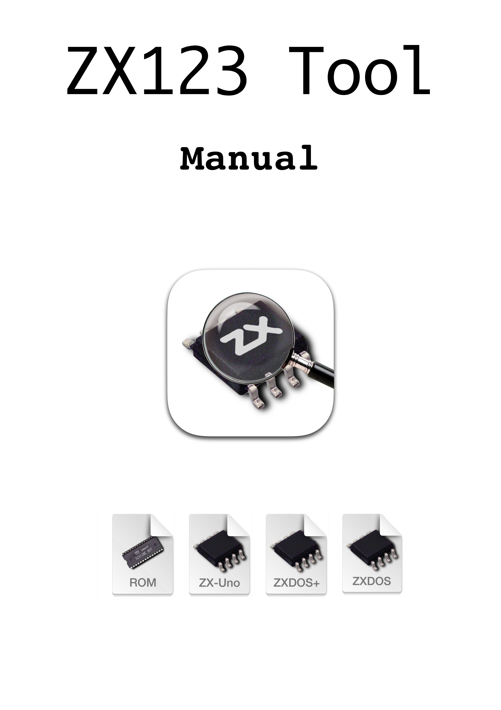

= Manual de ZX123 Tool
:author: kounch
:revnumber: 1.0.0
:doctype: book
:notitle:
:front-cover-image: image:img/Portada.jpg[]
:email: kounch@users.noreply.github.com
:Revision: 1.0
:description: Manual en Castellano de ZX123 Tool
:keywords: Manual, Castellano, ZX123 Tool, ZX-Uno, ZXDOS, ZXDOS+
:icons: font
:source-highlighter: rouge
:toc: left
:toc-title: Índice
:toclevels: 4

<<<

== Introduction

ZX123 Tool es

[.text-center]

